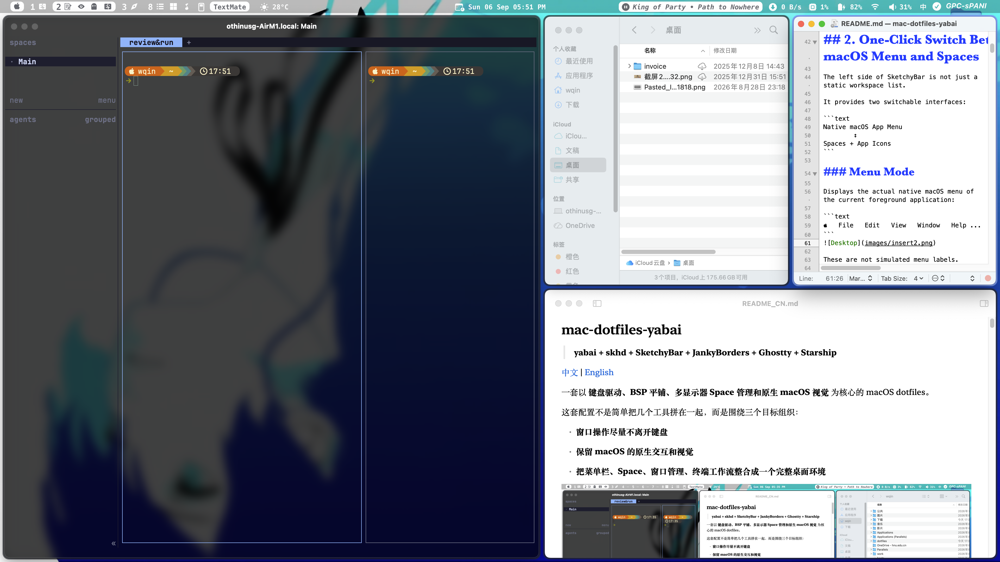
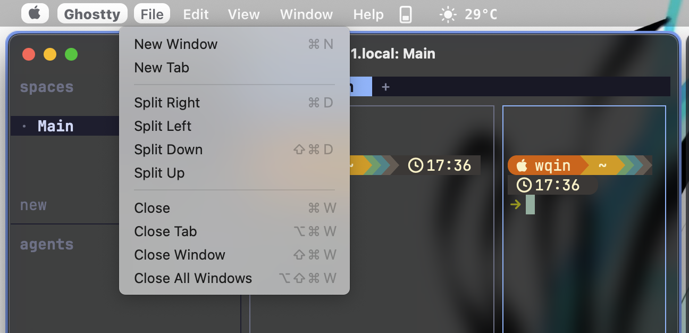

# mac-dotfiles-yabai

> **yabai + skhd + SketchyBar + JankyBorders + Ghostty + Starship**

[中文](README_CN.md) | [English](README.md)

A macOS dotfiles setup centered around **keyboard-driven workflows, BSP tiling, multi-display Space management, and a native macOS visual style**.

This setup is not just a collection of unrelated tools. It is organized around three goals:

- **Keep window management on the keyboard as much as possible**
- **Preserve native macOS interaction and visual behavior**
- **Integrate the menu bar, Spaces, window management, and terminal workflow into one cohesive desktop environment**



---

# Highlights

## 1. yabai BSP: Tiling, Animation, Opacity, and Multi-Display Spaces

The window management core uses the BSP layout from [yabai](https://github.com/asmvik/yabai).

The current configuration enables:

```text
BSP tiling
Window animation
Window opacity
Window gaps / padding
Mouse move / resize
Stack
Space management
Multi-display navigation
```

Window switching keeps the benefits of tiling while also providing smoother animation and opacity feedback.

---

## 2. One-Click Switch Between the Native macOS Menu and Spaces

The left side of SketchyBar is not just a static workspace list.

It provides two switchable interfaces:

```text
Native macOS App Menu
        ↕
Spaces + App Icons
```

### Menu Mode

Displays the actual native macOS menu of the current foreground application:

```text
   File   Edit   View   Window   Help ...
```


These are not simulated menu labels.

The configuration uses:

```text
SbarLua
C helper
macOS Accessibility / Menu API
```

to read the current application's menu and make it directly clickable. For better stability, I use a transparent native menu bar approach with SIP disabled. When a menu item is clicked, the actual native menu is opened and overlaid 1:1 on top of SketchyBar.

### Switching Modes

Click:

```text
Front App
```

or the Spaces indicator to switch between the two modes.

---

## 3. Complete Reminders Directly from SketchyBar

SketchyBar reads:

```text
Reminders → Inbox
```

It reads tasks from the list named `Inbox`, ordered from newest to oldest, and displays one incomplete task.

Quick actions:

| Action | Function |
| --- | --- |
| `Ctrl + Left Click` | Complete the current Reminder |
| `Ctrl + Right Click` | Open Reminders.app |

This makes it possible to handle simple tasks directly from the menu bar.

---

## 4. Input Source Status

SketchyBar displays the current input source:

```text
Chinese
English
Japanese
Korean
```

The input source helper is written in C and is compiled automatically when SketchyBar starts:

```text
helpers/input_source/input_source.c
```

---

## 5. Clash Verge Connectivity Status

The Wi-Fi icon on the right side of SketchyBar displays the connectivity status of the current Clash Verge node by default. This only supports Clash Verge and does not rely on Mihomo-specific features.

If the current node loses connectivity, the icon is shown as disconnected in red.

The original Wi-Fi connection-status logic is still included. To use it instead, rename:

```text
/.config/sketchybar/plugins/wifi_old.sh
```

to:

```text
wifi.sh
```

---

## 6. Music Controls

The default player is:

```text
Apple Music
```

The configuration also retains support code for:

```text
Spotify
MPD / rmpc
YouTube Music
```

They are not enabled by default, but can be enabled manually.

The status bar displays:

```text
Track • Artist
```

Controls:

| Action | Function |
| --- | --- |
| Left Click | Play / Pause |
| Right Click | Next |
| `Ctrl + Right Click` | Previous |

---

# Installation

The current yabai configuration enables:

```text
window opacity
window animation
advanced Space operations
```

and `yabairc` executes:

```bash
sudo yabai --load-sa
```

Therefore, this setup requires the **yabai scripting addition**.

---

## 1. Xcode Command Line Tools

Install:

```bash
xcode-select --install
```

This provides:

```text
git
clang
make
```

`clang` / `make` are also used to compile the SketchyBar C helpers and SbarLua.

---

## 2. macOS Settings

Make sure the following option is enabled:

```text
System Settings
→ Desktop & Dock
→ Mission Control
→ Displays have separate Spaces
```

Also disable:

```text
Automatically rearrange Spaces based on most recent use
```

because the current shortcuts rely on a stable Space order.

On newer versions of macOS, it is also recommended to set:

```text
System Settings
→ Desktop & Dock
→ Click wallpaper to reveal desktop
→ Only in Stage Manager
```

to avoid abnormal yabai Space / Display focus behavior.

---

## 3. Optional: Partially Disable SIP

> [!WARNING]
> This step is only required if you want to use **window animation, opacity, and advanced Space controls** from the current configuration.
>
> Partially disabling SIP reduces some macOS system protections. Make sure you understand the implications before continuing.

### Apple Silicon + macOS 13 or newer

Shut down the Mac.

Hold the power button to enter:

```text
Startup Options
→ Options
→ Continue
```

Open:

```text
Utilities
→ Terminal
```

Run:

```bash
csrutil enable --without fs --without debug --without nvram
```

Restart into macOS, then run:

```bash
sudo nvram boot-args=-arm64e_preview_abi
```

Restart again.

Check the status:

```bash
csrutil status
```

On newer versions of macOS, a partially disabled SIP configuration may show:

```text
System Integrity Protection status: unknown (Custom Configuration)
```

Full documentation:

https://github.com/asmvik/yabai/wiki/Disabling-System-Integrity-Protection

---

## 4. Install Homebrew

```bash
/bin/bash -c "$(curl -fsSL https://raw.githubusercontent.com/Homebrew/install/HEAD/install.sh)"
```

---

## 5. Install Core Packages

Only the top-level dependencies directly used by this desktop configuration are installed here.

```bash
brew tap asmvik/formulae
brew tap FelixKratz/formulae

brew install \
  asmvik/formulae/yabai \
  asmvik/formulae/skhd \
  sketchybar \
  borders \
  jq \
  lua \
  starship \
  zsh-syntax-highlighting \
  zsh-autosuggestions \
  zsh-completions
```

Fonts and Ghostty:

```bash
brew install --cask \
  ghostty \
  font-hack-nerd-font \
  font-jetbrains-mono-nerd-font \
  font-sketchybar-app-font \
  sf-symbols
```

---

## 6. Install SbarLua

The left side of SketchyBar:

```text
Native Menu
Spaces
Front App
```

is powered by SbarLua.

Install it with:

```bash
git clone https://github.com/FelixKratz/SbarLua.git /tmp/SbarLua && \
cd /tmp/SbarLua && \
make install && \
cd ~ && \
rm -rf /tmp/SbarLua
```

SbarLua will be installed to:

```text
~/.local/share/sketchybar_lua/
```

The current Lua configuration loads it directly from there:

```lua
require("sketchybar")
```

You can also download and run `install_sbarlua.sh` from the repository to install it automatically.

---

## 7. Clone & Overwrite

> [!CAUTION]
> The command below directly deletes the existing:
>
> ```text
> ~/.config
> ```
>
> No automatic backup is created.

```bash
git clone https://github.com/OthinusG/mac-dotfiles-yabai.git ~/mac-dotfiles-yabai && \
rm -rf ~/.config && \
cp -R ~/mac-dotfiles-yabai/.config ~/.config && \
cp ~/mac-dotfiles-yabai/.zshrc ~/.zshrc && \
cp ~/mac-dotfiles-yabai/.zprofile ~/.zprofile && \
cp ~/mac-dotfiles-yabai/.bashrc ~/.bashrc && \
cp ~/mac-dotfiles-yabai/.bash_profile ~/.bash_profile
```

---

## 8. Configure yabai Scripting Addition

The current `yabairc` already contains:

```bash
sudo yabai --load-sa
yabai -m signal --add event=dock_did_restart action="sudo yabai --load-sa"
```

Therefore, this command needs to be allowed to run without a password prompt.

Run:

```bash
echo "$(whoami) ALL=(root) NOPASSWD: sha256:$(shasum -a 256 $(which yabai) | cut -d " " -f 1) $(which yabai) --load-sa" | \
sudo tee /private/etc/sudoers.d/yabai
```

> After upgrading yabai, the binary hash changes. Run this command again after every yabai upgrade.

---

## 9. Start

### yabai

```bash
yabai --start-service
```

After the first launch, grant permission in:

```text
System Settings
→ Privacy & Security
→ Accessibility
→ yabai
```

The current configuration uses window animation, so you may also need to grant the relevant Screen Recording permission when prompted by yabai.

---

### skhd

```bash
skhd --start-service
```

Grant permission in:

```text
Privacy & Security
→ Accessibility
→ skhd
```

---

### SketchyBar

```bash
brew services start sketchybar
```

Reload:

```bash
sketchybar --reload
```

---

### JankyBorders

```bash
brew services start borders
```

Restart:

```bash
brew services restart borders
```

---

# Configuration

# yabai

Configuration file:

```text
~/.config/yabai/yabairc
```

---

## Mouse

Hold:

```text
Fn + Mouse
```

to use:

```text
Mouse Button 1 → Move
Mouse Button 2 → Resize
Drop           → Swap
```

---

## Floating / Unmanaged Apps

The following applications are excluded from BSP management by default:

```text
LuLu
Calculator
Software Update
Dictionary
VLC
System Settings
Zoom
Photo Booth
Archive Utility
Python
LibreOffice
App Store
Steam
Alfred
Activity Monitor
```

Special rules are also configured for some Dialog / Preferences windows from:

```text
Finder
Safari
System Information
Inkscape
```

---

# skhd

Configuration file:

```text
~/.config/skhd/skhdrc
```

---

## Space

| Shortcut | Action |
| --- | --- |
| `Alt + 1...0` | Focus current display's Space 1–10 |
| `Shift + Alt + 1...0` | Move window to local Space and follow |
| `Shift + Alt + P` | Move to previous Space |
| `Shift + Alt + N` | Move to next Space |

---

## Focus

| Shortcut | Action |
| --- | --- |
| `Alt + H` | Focus west |
| `Alt + J` | Focus south |
| `Alt + K` | Focus north |
| `Alt + L` | Focus east |
| `Alt + U` | First window |
| `Alt + I` | Last window |

If there is no window in the target direction:

```text
Alt + H/J/K/L
```

will continue by attempting to focus the corresponding display in that direction.

---

## Window State

| Shortcut | Action |
| --- | --- |
| `Alt + Space` | Float / Unfloat |
| `Alt + F` | Zoom parent |
| `Shift + Alt + F` | Zoom fullscreen |
| `Shift + Alt + S` | Toggle split |

---

## Move Window

| Shortcut | Action |
| --- | --- |
| `Shift + Alt + H` | Move / Warp west |
| `Shift + Alt + J` | Move / Warp south |
| `Shift + Alt + K` | Move / Warp north |
| `Shift + Alt + L` | Move / Warp east |

When crossing the current display boundary, the configuration will continue by attempting to move the window to the adjacent display.

---

## Resize

| Shortcut | Action |
| --- | --- |
| `Ctrl + Alt + H/J/K/L` | Resize |
| `Ctrl + Alt + E` | Balance |
| `Ctrl + Alt + G` | Toggle gaps / padding |

---

## Stack

| Shortcut | Action |
| --- | --- |
| `Shift + Ctrl + H/J/K/L` | Stack in direction |
| `Shift + Ctrl + N` | Next window in stack |
| `Shift + Ctrl + P` | Previous window in stack |

---

## Insertion

| Shortcut | Action |
| --- | --- |
| `Shift + Ctrl + Alt + H` | Insert west |
| `Shift + Ctrl + Alt + J` | Insert south |
| `Shift + Ctrl + Alt + K` | Insert north |
| `Shift + Ctrl + Alt + L` | Insert east |
| `Shift + Ctrl + Alt + S` | Insert stack |

Quickly create a new window:

```text
Alt + S → Insert east  + Cmd + N
Alt + V → Insert south + Cmd + N
```

---

## Mirror

```text
Shift + Alt + X → Mirror X axis
Shift + Alt + Y → Mirror Y axis
```

---

# SketchyBar

## Weather

Default:

```text
Baidu Weather
```

Configuration:

```text
~/.config/sketchybar/settings.sh
```

Current values:

```bash
WEATHER_BAIDU_QUERY="上海闵行天气"
WEATHER_BAIDU_SRCID="4982"
```

The following providers are also retained:

```text
NMC
Open-Meteo
```

Corresponding settings:

```bash
WEATHER_NMC_STATIONID="HIieJ"

WEATHER_METEO_LATITUDE=30.2416
WEATHER_METEO_LONGITUDE=120.1189
```

---

## Network Rate

Configuration:

```text
plugins/network_rates.sh
```

Default interface:

```bash
INTERFACE="en1"
```

Check the network interfaces on your Mac:

```bash
networksetup -listallhardwareports
```

If Wi-Fi uses:

```text
en0
```

change it to:

```bash
INTERFACE="en0"
```

---

## Proxy

Enable:

```bash
proxy
```

Disable:

```bash
unproxy
```

Current values. Change the port if necessary:

```text
HTTP_PROXY   http://127.0.0.1:7897
HTTPS_PROXY  http://127.0.0.1:7897
ALL_PROXY    socks5h://127.0.0.1:7897
```

---

## AI Keys

`.zshrc` automatically loads:

```text
~/.ai_keys
```

This keeps API keys separate from the public dotfiles repository.

---

## Karabiner

Install:

```bash
brew install --cask karabiner-elements
```

The current configuration includes a Hyper Layer for:

```text
Cursor movement
Text selection
Text deletion
F1–F12
```

---

## Neovim

Minimum installation:

```bash
brew install neovim
```

For full support for the current Telescope / fzf-native / Markdown Preview configuration:

```bash
brew install \
  fd \
  ripgrep \
  cmake \
  node \
  yarn
```

---

# Per-machine Settings

After copying the configuration, these are the main values you may want to change first.

| Setting | File | Current value |
| --- | --- | --- |
| Network interface | `sketchybar/plugins/network_rates.sh` | `en1` |
| Weather location | `sketchybar/settings.sh` | Minhang, Shanghai |
| Weather coordinates | `sketchybar/settings.sh` | `30.2416, 120.1189` |
| Proxy | `.zshrc` | `127.0.0.1:7897` |

---

# References

- [yabai](https://github.com/asmvik/yabai)
- [skhd](https://github.com/asmvik/skhd)
- [SketchyBar](https://github.com/FelixKratz/SketchyBar)
- [SbarLua](https://github.com/FelixKratz/SbarLua)
- [JankyBorders](https://github.com/FelixKratz/JankyBorders)
- [Ghostty](https://ghostty.org/)
- [Starship](https://starship.rs/)
- [Herdr](https://herdr.dev/)
- [sketchybar-app-font](https://github.com/kvndrsslr/sketchybar-app-font)
- [Sinjhin/SketchyMenu](https://github.com/Sinjhin/SketchyMenu)
- [th-ch/youtube-music](https://github.com/th-ch/youtube-music)

---

## Disclaimer

These are personal dotfiles, not a plug-and-play macOS distribution.

The current configuration uses the yabai scripting addition and depends on a partially disabled SIP configuration, macOS Accessibility permissions, and several machine-specific paths. Review the configuration and adapt it to your own environment before using it.
